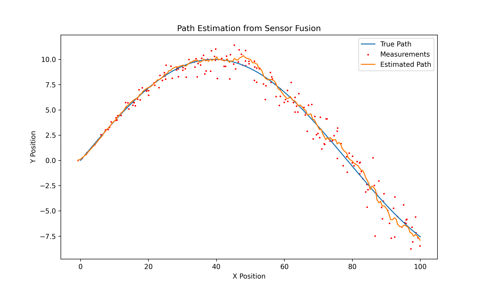

# Sensor Fusion with Kalman Filtering (2D Tracker)

This project simulates a 2D tracking system that fuses simulated **radar** and **camera** data to estimate the position and constant velocity of a moving target by manually constucting and using a **Kalman Filter**.

It models a full end-to-end pipeline: from noisy sensor measurements in **polar coordinates**, through **conversion to Cartesian space**, to real-time tracking and estimation.

The final plot displays **positon** vs **time** including the true data, measured data, and Kalman estimated prediction.

---

## Features

- Simulated 2D motion with curved path
- Noisy **radar (range)** and **camera (bearing)** measurements
- Realistic noise stacking due to polar → Cartesian conversion
- Kalman filter for 2D position and velocity estimation
- Visual comparison of:
  - True path
  - Noisy sensor measurements
  - Filtered estimates

---

## Sample Output

---

## Dependencies
- Python
- NumPy
- matplotlib

___

## 🧠 What I Learned

- How to simulate realistic sensor fusion behavior using noisy range and bearing data
- Why polar-to-Cartesian conversion causes non-uniform measurement noise
- How to implement a 2D Kalman Filter for position and velocity estimation
- The importance of tuning process and measurement noise (Q and R matrices)

---

## 🚀 Future Improvements

- Simulate asynchronous sensor update rates (e.g. radar at 5 Hz, camera at 10 Hz)
- Add acceleration to the state model (e.g. constant acceleration Kalman filter)
- Introduce multiple targets and implement basic data association
- Simulate sensor dropout or temporary sensor failure
- Visualize velocity estimation error over time
- Package into a reusable module for other sensor fusion experiments

---

### Why Measurement Noise Appears to Stack

In a funny effort (now in hindsight) I spent some time trying to find where I was stcking noise in my code as we can clearly see it in the final plot. Turns out, it's no coding error.

In this project, we simulate measurements from a radar (range `r`) and a camera (bearing `θ`), both of which include Gaussian noise. These are then converted to Cartesian coordinates `(x, y)` using:

x = r · cos(θ),  y = r · sin(θ)

Although the noise added to `r` and `θ` is stationary (same standard deviation at each timestep), the **Cartesian error grows with target distance** due to the angle component. 

At **close range**, a small angular error results in only a small position offset:

- Imagine a target 1 meter away.
- A 2° error in bearing leads to a tiny deviation in `(x, y)`.

At **long range**, the same angular error causes a much larger offset:

- A target 100 meters away with a 2° error causes a large lateral shift.
- The projection of the angle error grows with range:  
  Δx ≈ r · Δθ

So even though our `θ` noise is fixed (e.g. 1°), its effect **scales with distance**. 
